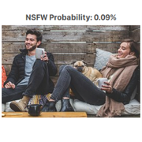

# MyDataset description

Detect Inappropriate Content In Your Images. Use Yahoo Open NSFW to detect the possibility that your image is not suitable for work (pornographic content). Detection ranges from 0 to 100%.
